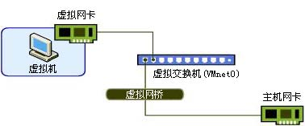
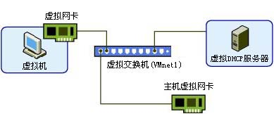
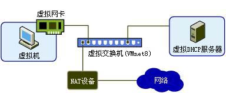

# vmnet0、vmnet1、vmnet8 区别
   1. vmnet0

      **桥接网卡**，虚拟机相当于一台实体机，可以自用访问与被访问及上网。
      
  
 

   2. vmnet1 

      **Host-Only网络模式**，虚拟机之间、主机与虚拟机之间互访，虚拟机无法访问外网。
      
  
 
   3. vmnet8 

      **NAT**，虚拟机之间、主机与虚拟机之间互访，虚拟机可以通过主机访问外网，外网无法访问虚拟机。
      
  
 

 > 参考 [wmware的vmnet0、vmnet1、vmnet8](https://www.cnblogs.com/asker009/p/10143698.html)
 