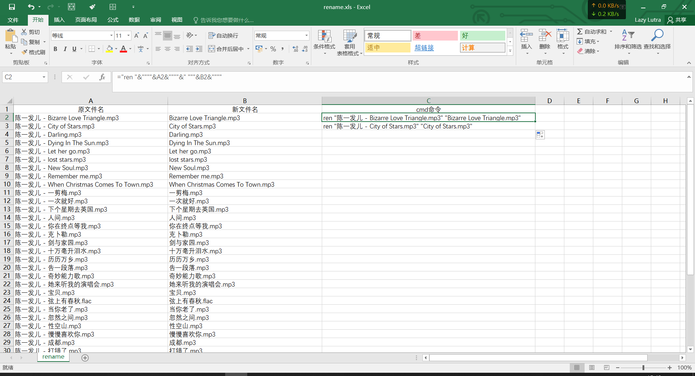
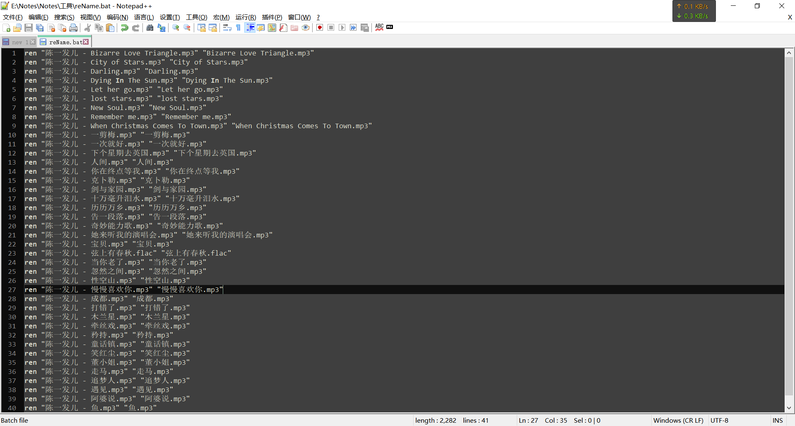
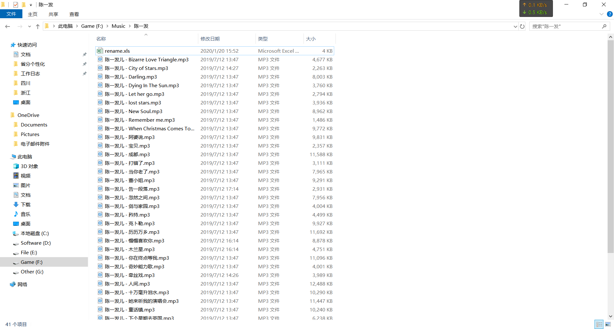
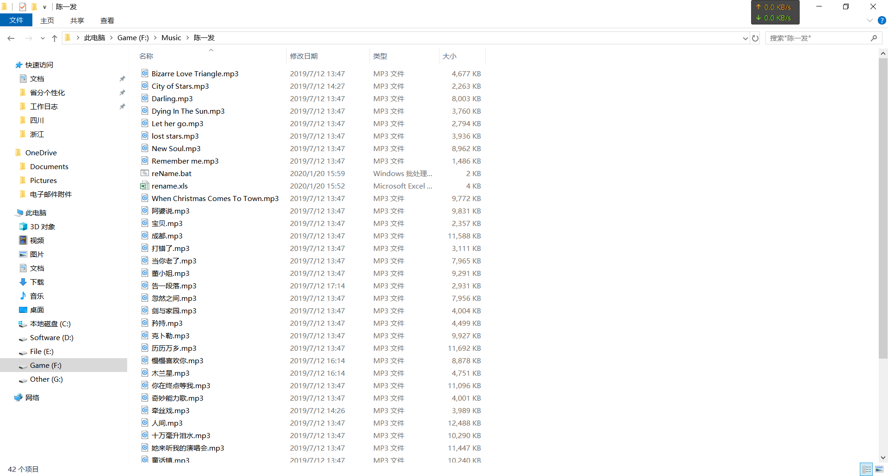

<!-- TOC -->

- [1. 命令行生成文件名excel表格](#1-命令行生成文件名excel表格)
- [2. 生成cmd命令](#2-生成cmd命令)
- [3. 执行bat文件](#3-执行bat文件)
- [4.前后对比](#4前后对比)
- [5.注意事项](#5注意事项)

<!-- /TOC -->
# 1. 命令行生成文件名excel表格
 1. win + r
 2. cmd
 3. 打开文件目录
 4. dir /b>rename.xls

# 2. 生成cmd命令
 1. 创建新列，修改新文件名
    
 2. 创建新列，生成cmd命令 ="ren "&""""&A2&""""&" """&B2&""""
    

# 3. 执行bat文件
 1. 复制命令，生成bat文件 
    
 2. 放到根目录下，执行bat文件
    

# 4.前后对比
 
 

# 5.注意事项
**bat文件需要使用ANSI格式**