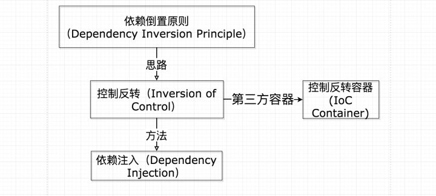

# 1.概述
## 1.1 是什么 
 **控制反转**是**依赖倒置原则**的一种代码实现思路，采用的具体方法是**依赖注入**。关系如下图：

   

 依赖注入(DI)和控制反转(IOC)是从不同的角度的描述的同一件事情，就是指**通过引入IOC容器，利用依赖关系注入的方式，实现对象之间的解耦**。

## 1.2 解决了什么问题
 > 为了解决对象之间耦合度过高的问题。

 **举例** ：
我们先设计汽车的大概样子，然后根据汽车的样子来设计车身，根据车身来设计底盘，最后根据底盘来设计轮子。这时候，依赖关系就倒置过来了：轮子依赖底盘， 底盘依赖车身， 车身依赖汽车。 
这时候，上司再说要改动轮子的设计，我们就只需要改动轮子的设计，而不需要动底盘，车身，汽车的设计了。这就是依赖倒置原则——把原本的高层建筑依赖底层建筑“倒置”过来，变成底层建筑依赖高层建筑。高层建筑决定需要什么，底层去实现这样的需求，但是高层并不用管底层是怎么实现的。这样就不会出现前面的“牵一发动全身”的情况。  

 [为什么需要依赖注入](https://zhuanlan.zhihu.com/p/29426019)

## 1.3 IoC的优点
 1. **资源集中管理** 
 2. **降低耦合**
 3. **高可复用性**
 4. **组件热拔插特性**

# 2.使用
 [Spring DI的配置与使用](https://www.cnblogs.com/linjiqin/p/3416891.html)

## 2.1 注入方式
### 1. 构造函数注入
